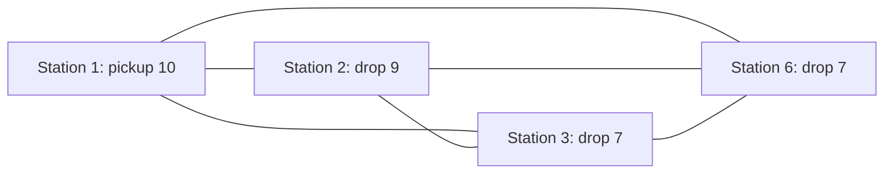

# Cheap necessary conditions and a four-station conflict

After the four frozen inventory LP/MIP diagnostics, check whether their
classifications really require solving the whole routing problem. This is
solver-free analysis of the same three historical patterns, not an extra
candidate, free algorithm input, parameter sweep or callback separation.
Use one rule with at most 50,000 subsets per pattern; do not keep looking for
another cut after a nonviolated no-good. Preserve the predeclared bounded MIP
release experiment as an independent check on the cost of the integer oracle.

Budget allocation before the formal proof batch: charge the reusable generator
as one solver-free proof-construction batch (three fixed historical patterns,
50,000 subset checks each, 10-second process cap, zero optimizer calls). Use
two rather than all three originally reserved MIP release calls, keeping the
same zero-displacement-then-smallest-displacement order. The smaller analytic
conflict and its nonviolation make a third analogous MIP release low value.
This leaves the projected final charged total at 71/72, including the final
corrected K1 pair, with one reserve launch. Earlier arithmetic/source inspection
was analysis, not an additional candidate or optimizer experiment.

For a required service i, every vehicle starts empty, so its total pickups
must be at least max(p_i,d_i). On the frozen Euclidean travel inputs,
`D_k >= 2*d(0,i) + c*max(p_i,d_i)`.
For two required services i,j on the same vehicle, every route has
`travel >= d(0,i)+d(i,j)+d(j,0)` and
`total_pickups >= max(p_i+p_j,d_i+d_j)`.
Thus their sum is a valid lower bound even when other stations remain free
to supply bikes, receive bikes or participate elsewhere on that route.
There is no assumption that the two stations must form a self-contained route.

Put an incompatibility edge between i,j when this lower bound strictly exceeds
the original common T by the frozen numerical margin. A clique of M+1 required
stations cannot be assigned to M vehicles. At least one pair would share a
vehicle; hence Tstar is at least the minimum pair bound within this clique.
This is a global conditional inventory certificate for this input/T, valid
across all Gini leaves. It uses no improving-domain or objective-cutoff premise.
It is a standard resource incompatibility argument, not a novelty claim.

D4 has a clique on stations 1,2,3,6, reducing the logical inventory conflict
from twelve fixed station inventories to four without a heavy proof search.
It is not asserted to be a minimum-cardinality conflict.

Every edge means these two fixed services cannot share a vehicle within T=2400.
Four mutually incompatible services require at least four vehicles, but M=3.

All six numerical pair inequalities, timings, exact bit coefficients and
recorded-point checks are generated by `scripts/round61_cheap_time.py` into
`cheap_inventory_time_diagnostics.json`. The bit no-good is not violated on
the recorded first/latest root or sampled nonroot points. No static cut trial
is justified by these specific rows. D3 has no M+1 clique in this bounded
exhaustive small-instance check; this does not prove that every other cheap
necessary condition must fail.
