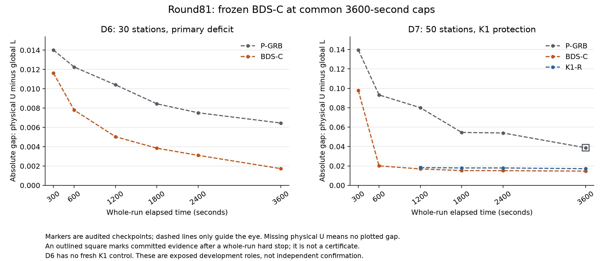

# Round81: long D7 protection and reproducible primary gains

The unchanged BDS-C method materially improves D7 at a fresh common3600s cap:
absolute gap is62.2245% smaller than P-GRB and14.6892% smaller than K1-R.
Its unclipped retention of K1's P-relative gap advantage is1.116733. The key
D6 primary gap gain repeats at73.2392%, following73.6448% in R80. S12's severe
K1 regression repair, C2's certificate gain and D4's certificate protection
also reproduce. This completes the bounded development validation, not the
overall goal or independent confirmation.

Base R80 final634cf03982e71849079699848ceecc3cd19ecb72 / draft PR141;
branch codex/round81-bdsc-long-protection-replication. There is no C++, algorithm
parameter, default or main change. The single preset is still
research-round78-vds-balanced-descent, qualified source
4a0561e0f8193e3e874c1bd0bfa8bc381fb66f5e and executable
build/round78/v1/ExactEBRP.exe, SHA256
3fae847a75c3c9d07d8f5f0444daeafb73559865e6bffb816746802b9e2f43ab.
publication.json records independent draft PR142,
https://github.com/yifanXovo/TailoredExact/pull/142 . Fresh readback verifies the
exact evidence head b5b290d1ba940a82934fe7108cb1b20665fd8887, R80 base,
open/draft/unmerged state and original history.

## Complete fresh results

All14 admitted arms finish within their declared caps and pass independent
physical/scope/coverage audits. Thirteen return normally. D7 P-GRB reaches the
predeclared whole-run hard stop at3598.062s: its committed physical U and global
L are valid, but it has no normal finalization or certificate. This distinction
is retained in every endpoint record; it is not relabeled a normal return.

|Role / common cap|P-GRB paid s / status|BDS-C paid s / status|K1-R paid s / status|Certified original F|
|---|---|---|---|---:|
|S12 /120s|5.640 / certified|1.797 / certified|40.594 / certified|.058563973126|
|C2 /300s|297.062 / open|113.469 / certified|297.078 / open|.829963413172|
|D4 /300s|297.078 / open|52.734 / certified|134.687 / certified|.506343307565|
|D6 /3600s|3597.172 / open|3597.172 / open|No fresh arm|Not certified|
|D7 /3600s|3598.062 / hard stop, open|3597.391 / open|3597.141 / open|Not certified|

Every open endpoint remains visible:

|Role / arm|Physical U|Global L|Absolute gap|Relative gap|
|---|---:|---:|---:|---:|
|C2 / P|.829963413172|.771071519989|.058891893183|.070957216|
|C2 / K1-R|.829963413172|.797157738520|.032805674652|.039526652|
|D4 / P|.506343307565|.194512199568|.311831107997|.615849175|
|D6 / P|.157241175852|.150789488407|.006451687445|.041030521|
|D6 / BDS-C|.157509803615|.155783279771|.001726523844|.010961374|
|D7 / P|.237284991549|.198586493177|.038698498372|.163088690|
|D7 / BDS-C|.219311768493|.204693211287|.014618557206|.066656511|
|D7 / K1-R|.215644075316|.198508420283|.017135655033|.079462675|

Relative gap is(U-L)/abs(U). The inherited practical rules are unchanged:
small certified pairs require>2s/>20% for material improvement; other certified
pairs>10s/>15%; open gaps>.001/>10%. Certificate gain/loss is separate. S12's
BDS-C P gain is3.843s; K1's34.954s regression is severe under the frozen
>5s/>50% small-case rule. D4's K1 certificate advantage is preserved and
certification becomes81.953s faster. C2 retains its nonzero certificate gain
over both controls. Tiny signed numerical gaps are not overwritten: D4 K1's
certificate still has gap2.3864232812e-10. These are original-tolerance numerical
certificates, not strict rational proofs.

D6's candidate U is worse than P by.000268628, while L is stronger by.004993791.
The73.2392% gap reduction is a proof gain, not primal dominance or optimality.
There is no fresh D6 K1 arm; the R80 K1 result is never imported into this pair.
D7 improves both P bounds: U is lower by.017973223 and L higher by.006106718.
Against K1, BDS-C's U is worse by.003667693 but L is stronger by.006184791;
the resulting.002517098 absolute gap reduction exceeds the material rule.
The1.116733 K1-advantage retention is descriptive, not an algorithm gate.

## Trajectories and finite replication

The63 frozen checkpoints use availability=max(payload closure, completed
observer read). All raw receipts are observed; there is no promoted incomplete
payload. The D7 K1 startup witness becomes available at613.250s, so300/600s
have no physical U or reported gap. A missing U is not assigned0% or100%.

|D7 observed seconds|P gap|BDS-C gap|K1-R gap|
|---:|---:|---:|---:|
|300|.139455121|.097807595|Unavailable U|
|600|.093231319|.020043601|Unavailable U|
|1200|.080034387|.016887891|.018286596|
|1800|.054511363|.015199479|.017914353|
|2400|.053972977|.015113851|.017914353|
|3600|.038698498|.014618557|.017135655|

P's late primal improvement is retained. BDS-C's long-window advantage therefore
does not rely on selecting the earlier window in which P was weaker. D6 BDS-C
materially improves P at all six declared checkpoints. The plotted points are
the audited observations; connecting lines are visual guides, not additional
measurements. The square identifies P's valid hard-stop evidence.

All eleven same-cap original/repeated endpoints are retained in replication.json,
with source/binary/input/flag identity checked. R79 S12 P/BDS/K1 times
5.657/1.812/40.734 become5.640/1.797/40.594. C2 BDS certification113.875 becomes
113.469; D4 BDS/K1 certification52.922/135.172 becomes52.734/134.687. The open
C2/D4 controls and all their original/repeated bounds remain in the machine
records. D6's R80 P/BDS gaps.006458865462/.001702249813 become
.006451687445/.001726523844: the main gain reproduces despite a slightly worse
candidate gap. No fastest or best realization is selected.

D7's nine cross-cap300/600/1200 comparisons bind the R78 identities separately.
They show no material gap deterioration, but a fresh3600 cap is not an
identical-cap replication of1200: native default strategies can respond to the
deadline. Checkpoints are not independent samples. This finite replication
does not establish statistical equivalence or universal timing stability.

## Actual mechanism and complete method

unified_method.md consolidates the source-grounded algorithm, original model
semantics, pseudocode, parameters, correctness scope and implementation map.
It distinguishes the active AM eta*mu threshold.08 from inactive compatibility
fields, and the full greedy decoder from an ignored legacy iteration argument.
Disabled local MIP-oracle stubs do not become hidden internal time slices.
This is documentation of the frozen method, not a new algorithm or novelty claim.

All five BDS-C runs complete25 current-run paths, matching all available prior
logical traces. Every strict/balanced transition and actual outer handoff passes
independent replay. S12/C2/D4 accept no closure moves; their retained initial and
final routes coincide. D6 accepts2 neutral and4 quantity moves. D7 accepts4
neutral,2 insertion and44 quantity moves, ending startup at F.300543518294,
49 served stations/206 pickup/206 drop/max duration13547.574s. Both long roles
hand their strictly improved final routes to the outer algorithm. S12 retains
its legal15-unit loaded return. No historical witness enters a formal run.

D7 BDS-C enters its exact phase at10.536370s; K1 at613.190993s after2739 HGA
generations and2000 without improvement. BDS-C's starter is worse than K1's
.215644075316, and its final U remains worse. K1 has zero native MIPSOL
witnesses; its original-verified same-run HGA route is a valid formal U. P has
no HGA, so the full candidate's P proof gain cannot be described solely as
removing K1 startup. No startup cost is subtracted and this stage does not
isolate one component as the unique cause of the complete-method improvement.

D7 BDS-C uses3 LP calls and1 MIP; K1 uses5 LP calls and1 MIP. Their actual MIPs
have104726 rows/25943 columns and103581 rows/23563 columns respectively.
BDS-C records683 nodes/4815722 simplex iterations/3569.84 native seconds;
K1 records1277 nodes/3778544 iterations/2960.80s. P's original compact has
35618 rows/13360 columns; no final native Work/node total exists after its hard
stop. Model size, node count and Work are explanatory, not substitute outcomes.

All7 actual BDS-C Start decisions are eligible and accepted; independent full
vectors, actual rows and readback pass. Maximum row violation is3.37e-14 and
readback difference0. Nine controls have no explicit Start. Acceptance alone
does not establish a causal speed benefit. Complete exact coverage and original
physical validity remain distinct from local-search exhaustion and efficiency.

## Validity, resources and stage decision

All269 production-source hashes and the binary identity are revalidated. Common
Gurobi13.0.2/Threads1/Seed0/PresolveAuto, zero requested gaps, unchanged numerical
tolerances and logical2/mask4 affinity/restoration are retained. Five fresh
zero-Optimize compact exports bind the original P models. No Start, cut or
imported bound is added to P. Input identities, V/M/Q/mathematical T, handling
60/60 and lambda.15 are frozen in campaign/identity.json; S12 has M1.

Audits validate436 physical witnesses(427 native/9 startup),22534 global-bound
events and23087 committed events. All five cross-arm and original/repeat bound
consistency checks pass without pooling their U/L into performance endpoints.
There are52 Optimize starts(P5/BDS26/K121),51 returns and one within-cap P hard
stop. No validity failure, supervisor exception, automatic rerun, new seed,
qualification/build/test, extension or confirmation occurs. d7_p_termination.md
explains the frozen interruption policy and the official TimeLimit limitation;
the invalid over-cap R72 watchdog run remains excluded.

Paid process wall totals19227.077s within the20160s plan. Separate per-run replay
costs.799696s; preflight.890031s includes.625s of reference exports. Joint audit
costs108.352397s, actual-mechanism checking3.325866s and replication.069753s.
Packaging with verification costs22.893553s; the documented separate byte check
costs2.160114s. An isolated plotting environment is installed only after solving
ends(26.285475s); Matplotlib3.11.2 renders the reviewed figure in3.138915s. No
postprocessing step makes an Optimize call or changes measured production bytes.

Fifteen lossless bundles contain46670 files,208721039 raw bytes and32013149
compressed bundle bytes, plus the2204779-byte compressed member manifest.
Both index/member agreement and every archived byte verify. Actual logs,
models, receipts, routes, vectors and all failure transport ledgers remain
available. See reproduce.md for the byte-only check, rendering environment and
absolute-Windows-path limitations; executables stay local with hashes.

Interim transport preserves three ordinary HTTPS failures, four failed CLI
Git Data API attempts and one connector tree error. Exact-object directory
publication subsequently verifies original blobs/trees/commits and uses only
non-force ref updates. These are publication failures, not solver failures.
The evidence push succeeds in29.130782s and a fresh read verifies its exact
head. Final metadata transport is retained locally and carried into the next
stage. A retained metadata-edit charset error is fixed with explicit UTF-8;
no experiment or evidence producer is rerun. Publication receipts bind the
independent draft PR. Interactive work is
not a complete machine-time census; ordinary usage remains available with37%
weekly remaining at closure, and no reset credit is consumed.

The evidence and inherited architecture pass stage review. Primary gains,
small regression repair and important certificate/gap protection reproduce;
there is no parameter revision or instance-specific exception. These are exposed
development roles, including related CitiBike geography. E7/E8's old non-startup
regression labels remain reclassified as in R66; this stage does not invent a
repair of a loss that did not reproduce.

The overall goal remains unmet. Preserve this one frozen candidate and next
admit a bounded, structurally diverse, unadapted confirmation stage, including
nonzero medium/large proof roles and explicit sample provenance. No new
confirmation input or result has been opened here. A successful development
panel and its draft PR cannot replace that evidence. Do not merge main.
