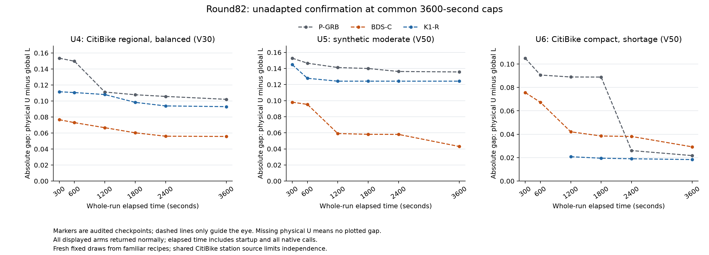

# Round82: five primary gains and a consequential U6 confirmation loss

The frozen BDS-C method transfers its primary benefit to five of six new
unadapted roles, but fails the consequential U6 long-window comparison.
At3600s U6 gap is34.3090% worse than P-GRB and59.0955% worse than
K1-R. Its stronger lower bound cannot compensate for the weaker upper bound.
K1 itself improves P by15.5796%, so this is also loss of a meaningful
K1 advantage. Overall goal remains unmet; the five gains do not cancel U6.
This is valid negative confirmation evidence, not a correctness failure.

Base R81 final298e97f5d163a54eb9d899c664cafd9f07c8647c / draft PR142;
branch codex/round82-bdsc-unadapted-confirmation. No production C++, parameter,
default or binary changes. One preset remains
`research-round78-vds-balanced-descent`, source
4a0561e0f8193e3e874c1bd0bfa8bc381fb66f5e, executable
build/round78/v1/ExactEBRP.exe SHA256
3fae847a75c3c9d07d8f5f0444daeafb73559865e6bffb816746802b9e2f43ab.
R81/unified_method.md and R78/mathematics.md define the unchanged algorithm,
parameters and analytic/numerical proof scope. Independent draft publication
is pending; publication.json will bind its actual head, base and draft state.

## Prospective data and comparison scope

The six roles and generation rules were committed before generation at
d7e5d5fd64ffffc1694d22cba8f1490cc19de1a6. All original inputs and the driver
were committed before optimization atc58797a610e7a4e3bfbeb702f702849dfdb7c51d.
Exactly six draws were generated once, with zero rejection/replacement/reseed,
zero screening solves and zero generation Optimize calls. No archived route,
known optimum or prior-run bound entered an algorithm.

|Role|Recipe|V/M/Q|Mathematical T|Whole cap per arm|
|---|---|---|---:|---:|
|U1|Synthetic three clusters, tight_T|12/1/20|2400|120|
|U2|Citi compact, surplus|12/2/30|3600|120|
|U3|Synthetic three clusters, high_imbalance|20/2/30|3600|300|
|U4|Citi regional, balanced|30/3/20|3600|3600|
|U5|Synthetic three clusters, moderate|50/3/20|3600|3600|
|U6|Citi compact, shortage|50/4/30|18000|3600|

The draws use familiar recipes. Citi coordinates/capacities share the known
443-station source; inventory, targets, weights, depot, fleet and operating
parameters are synthetic, travel is Euclidean/1.5 rather than a street network.
All63 overlap rows are retained, including complete station overlap of U2 with
an earlier larger selection. These are unadapted draws, not independent cities,
observed operating days or six independent population samples. Five roles
analytically exclude zero; U2's pre-solve status remains recorded as unknown,
although its eventual optimum is positive. No structural fact was used as a
selection filter or an extra algorithm bound. All six final objectives are
nonzero. See scope_and_nonzero.md, generation.json and protocol.json.

## Every original complete run

All18 serial arms return normally within their caps and pass independent
physical, scope/coverage, numerical and source-identity audits. There is no
hard stop, solver failure, invalid run, automatic retry, extra seed, replication,
extension or new qualification/build/test in this stage. The original driver
exits0; no optimizer remains. Whole wall includes startup, every model/probe/
native call, persistence, verification and exit.

|Role / cap|P-GRB paid s / status|BDS-C paid s / status|K1-R paid s / status|Certified original F|
|---|---|---|---|---:|
|U1 / 120s|3.641 / certified|0.875 / certified|2.063 / certified|1.688062526498|
|U2 / 120s|36.265 / certified|11.969 / certified|20.047 / certified|0.117274912125|
|U3 / 300s|297.062 / open|61.937 / certified|81.156 / certified|1.575438877992|
|U4 / 3600s|3597.172 / open|3597.125 / open|3597.203 / open|Not certified|
|U5 / 3600s|3597.141 / open|3597.110 / open|3597.157 / open|Not certified|
|U6 / 3600s|3597.297 / open|3597.157 / open|3597.171 / open|Not certified|

All ten open endpoints remain visible:

|Role / arm|Physical U|Global L|Absolute gap|Relative gap|
|---|---:|---:|---:|---:|
|U3 / P-GRB|1.575864177250|1.260257484701|0.315606692549|0.200275314|
|U4 / P-GRB|0.373133466199|0.271032017636|0.102101448564|0.273632514|
|U4 / BDS-C|0.377030801692|0.321319294490|0.055711507202|0.147763809|
|U4 / K1-R|0.375364476451|0.282413479660|0.092950996791|0.247628645|
|U5 / P-GRB|0.442174285749|0.306494229304|0.135680056444|0.306847460|
|U5 / BDS-C|0.429510307126|0.386521856827|0.042988450299|0.100087122|
|U5 / K1-R|0.450122773908|0.325906104721|0.124216669187|0.275961752|
|U6 / P-GRB|0.148197475295|0.126444468292|0.021753007003|0.146783924|
|U6 / BDS-C|0.159049196051|0.129832950686|0.029216245365|0.183693135|
|U6 / K1-R|0.145069572386|0.126705602130|0.018363970257|0.126587333|

Relative gap is(U-L)/abs(U) for available nonzero U. Signed numerical gaps
remain in machine records: U2 BDS/K1 gaps are-1.1241008124e-15/-9.0205620751e-16.
They are original-tolerance numerical certificates, not strict rational proofs.
The unchanged rules require both>2s/>20% for small certified improvements,
>10s/>15% for other certified pairs, and>.001/>10% for open-gap effects.
Certificate gain/loss is separate; no threshold was changed after outcomes.

U1 BDS improves P by2.766s, but its1.188s K1 gain is below the absolute small
threshold. U2 improves P by24.296s and K1 by8.078s; both are material. The early
commentary misclassification of U2/K1 was corrected in early_confirmation.md,
without changing data or thresholds. U3 gains a P certificate and retains K1's
certificate19.219s faster. U4 gap improves P45.4351% and K1 40.0636%, despite
worse U and stronger L. U5 improves P68.3163% and K1 65.3924%, with both bounds
better. U4/U5 K1/P gap differences remain below the10% relative rule; neither
is invented as a material K1 protection or deficit role.

U6 BDS U is worse than P by.010851721, while L improves by.003388482;
absolute gap increases.007463238. This is material, but not severe under the
frozen>.01/>50% P-regression rule. Against K1, gap increases.010852275 and
59.0955%, meeting that severe pairwise rule. K1's primary advantage is
.003389037 gap units, and BDS's unclipped P-relative retention is-2.202171.
This is a descriptive serious loss signal, not an algorithm gate or historical
record veto. P-relative regression and loss of current K1 advantage jointly
prevent overall acceptance. One fresh realization is not a repeatability or
statistical-significance claim; the adverse evidence is not dismissed as noise.

## Long-window reversal and actual mechanism

The84 frozen checkpoints,84 pair comparisons and28 protection rows use
availability=max(payload closure, completed observer read). Normal final
results are available only after exit. All receipts are observed, with no
uncommitted payload promoted. Checkpoints from one run are not independent
replicates. The critical U6 trajectory is:

|U6 observed seconds|P gap|BDS-C gap|K1-R gap|
|---:|---:|---:|---:|
|300|0.104995467|0.075630342|Unavailable U|
|600|0.090591066|0.067293721|Unavailable U|
|1200|0.088931780|0.042074334|0.020797459|
|1800|0.088870948|0.038511857|0.019521521|
|2400|0.026048598|0.038104558|0.019049559|
|3600|0.021753007|0.029216245|0.018363970|

BDS materially leads P through1800s, but P's late primal improvement reverses
the ordering by2400s. U6's outcome could not have been judged reliably from a
short positive window. K1's startup witness becomes available at921.046s;
its300/600 missing U/gap remain null, not0% or100% and not backdated.

All six BDS runs finish25 current-run paths at heuristic RNG seed20260626;
Gurobi Seed0 and independent data-generation seeds are distinct. The strict/
balanced replay and actual outer handoff pass. U1/U2/U3 accept no physical
closure moves. U4 accepts5 quantity moves; U5 accepts3 insertion/4 quantity
moves; neither accepts a balanced move. Their full-method benefits cannot be
attributed to a neutral operator that did not fire.

U6 does execute the mechanism:4 insertion,20 quantity and1 balanced move,
with local exhaustion and no deadline/verification failure. Original physical
startup F falls.243385550593 to.214430471758, and the final route reaches the
outer algorithm. It serves49 stations,176 pickup/drop units and has maximum
duration13872.148s. The neutral move shortens the maximum from15848.338s but
unlocks no further strict improvement. Each route returns empty because all
return loads are nonnegative and total pickup equals drop. These are local
search observations, not a global route-quality guarantee.

BDS enters the exact phase at13.199908s. K1 enters at920.989479s after2743
HGA generations and2000 without improvement. K1's verified starter is much
better: F.145069572386,50 stations,196 pickup/drop units,max duration17731.897s.
Its Gini term is.024687494085 versus BDS.093736757064, while the unscaled
penalties are close(.802547188676 versus.804624764624). Thus the starter gap
is predominantly Gini, not zero-objective waiting or a saved-runtime artifact.
All K1 startup cost remains paid. K1 has zero native MIPSOL witnesses, yet its
same-run verified HGA witness is a valid U. BDS makes82 native physical witness
records and P168; these counts are explanatory, not performance substitutes.

U6 P uses one MIP. BDS uses3 LP calls and1 MIP; K1 uses7 LP calls and2 MIP
invocations, including a mathematical-target stop and retained-model continuation.
All are charged. BDS's actual MIP has104352 rows/25569 columns and records
600 nodes/3794280 simplex iterations/3568.03 native seconds. P's compact has
35588 rows/13340 columns,8400 nodes/3867084 iterations. K1's final invocation
records2546 nodes/3922058 iterations/2642.15s. Fewer nodes, stronger L, accepted
Starts and a cheaper starter do not establish complete-method superiority.
This stage does not isolate one component as the unique cause of the loss.

All9 actual BDS Start decisions are independently checked. Eight eligible
vectors satisfy actual rows, objective and readback and are natively accepted;
maximum row violation is8.985e-13. U1 call5 correctly skips a witness outside
the active static Gini interval; it is not a missing or failed submission.
All12 controls have no explicit Start. No prior-route equality is claimed for
these new inputs. Complete exact coverage remains distinct from local exhaustion.

## Evidence, cost and stage decision

All269 production hashes, binary, driver, reader and six input identities are
revalidated. Six new zero-Optimize original compact exports bind P fingerprints.
Gurobi13.0.2, Threads1/Seed0/PresolveAuto, zero requested gaps, original numerical
tolerances, handling60/60,lambda.15 and original BRP semantics are unchanged.
Serial logical2/mask4 affinity and restoration are checked; the mixed-core
machine and lack of frequency lock remain disclosed. The sole whole-run
deadline and frozen shutdown policy never select an internal algorithm.

Audits validate614 physical witnesses(602 native/12 startup),8150 global-bound
events and8944 committed events. All six cross-arm consistency checks pass
without pooling U/L into a performance endpoint. All81 Optimize calls return:
P6/BDS35/K140. Total paid process wall is32889.548s within the34020s plan.
Separate per-run replay costs1.066255s; generation.288694s; preflight1.095860s
includes.749s of reference exports. Joint audit costs60.329986s, actual-mechanism
checking6.773454s, packaging/verification26.977776s and separate byte checking
1.934741s. No inherited qualification cost is counted again.

Nineteen lossless bundles contain18523 files,336846366 raw bytes and50774599
compressed bundle bytes. The884430-byte compressed member manifest binds each
path/length/SHA256; both index agreement and every archived byte pass twice.
Raw logs, models, receipts, operations and vectors are retained. See reproduce.md
for byte verification and the absolute-path/cross-OS replay limitation.

The existing R81 plotting environment is reused with no install. Initial
rendering costs1.326963s; its U5 legend/curve overlap is retained with a failed
layout review. A separate0.572565s layout revision moves the shared legend
outside all axes, passes visual review and has identical checkpoint bytes.
Both images, receipts and scripts remain; no solver or audit producer is rerun.

Two initial HTTPS publication failures and all exact-object recovery ledgers
remain. Successful non-force API publication preserves original blobs, trees,
author/committer metadata and commit hashes. They are transport events, not
solver failures. Interactive work is not a complete machine-time census.
Ordinary usage remains available with19% weekly remaining at queue closure;
no reset credit is consumed. Publication metadata will bind the separate draft.

Evidence and inherited architecture pass stage review. Confirmation performance
is mixed and fails overall acceptance because of U6's material P loss and
current K1-advantage loss. Earlier R79--81 repairs and gains remain valid in
their stated exposed-data scope; they cannot override this new result. See
goal_evidence_scope.md for the cross-stage map. No main merge or default change.

After publishing this stage, separately admit a bounded investigation of
served-block exchanges that preserve net load and original inventory, with
independent mathematical/physical checks and full current controls if promising.
next_hypothesis.md explains why merely allowing unbalanced one-way relocation
cannot help this empty-return witness. This is a hypothesis, not an implemented
or measured fix. Any revision using R82 outcomes makes these roles development
for that revision and requires new unadapted confirmation. Continue within
available resources; a negative-result draft PR does not end the overall goal.
