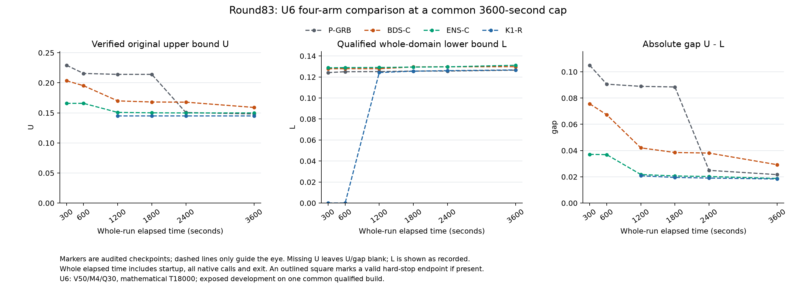

# Round83: equal-net exchanges and the U6 complete-method comparison

All thirteen original full runs are normal and valid. Complete campaign and
mechanism audits pass; delivery verifies twice. Stage evidence review is complete.
Independent draft PR144 is published: https://github.com/yifanXovo/TailoredExact/pull/144 .
Fresh readback verifies evidence head88403238e7e27f940f232e593a6d0d65356f5a20,
the exact R82 base and open/draft/unmerged state. No research process remains active.
Overall research goal remains unmet. No main/default merge.

ENS-C adds an inventory-preserving exchange of equal-net served blocks to the
existing physical duration descent. In the audited current-build U6 comparison,
its3600s absolute gap improves13.5852% against original P-GRB and35.8807%
against BDS-C. Against P its UB is worse and its LB is stronger. BDS-C still
has a34.7718% gap regression against current P. These are exposed development
results, not new unadapted confirmation or an overall-goal claim.

Base R82 final30996a5c023adc2257cf9f4581e3672cf9a644d1 / draft PR143.
Branch `codex/round83-equal-net-block-exchange`. New default-off preset
`research-round83-vds-equal-net-exchange`, qualified production source
4496078f25c0cdad1cf7a5c39835fd23121e8978, executable
`build/round83/v1/ExactEBRP.exe`, SHA256
25b7ec3a6d89d9f0f921c2984fbb1d9876f36f67e617af144275c88b44e6255e.
All current P/BDS/ENS/K1 controls use this same executable.

## Every original complete run

Whole caps: E8/N12 120s, D4 300s, U6 3600s. E8/N12/D4 use the original
P/ENS/K1 order; U6 uses P/BDS/ENS/K1. All costs include startup, every model
and native call, persistence and exit. Final relative gap is (U-L)/abs(U).
Signed tiny differences remain in machine records; no gap is clipped.

|Role|Arm|Paid seconds|Physical U|Global L|Signed absolute gap|Certificate|
|---|---|---:|---:|---:|---:|---|
|E8|P-GRB|1.938|0.0213370060398|0.0213370060398|-3.46944695195e-18|yes|
|E8|ENS-C|2.563|0.0213370060398|0.0213370060398|-6.93889390391e-18|yes|
|E8|K1-R|7.344|0.0213370060398|0.0213370060398|3.46944695195e-18|yes|
|N12|P-GRB|4.281|0.80462551972|0.80462551972|-1.11022302463e-16|yes|
|N12|ENS-C|1.422|0.80462551972|0.80462551972|1.11022302463e-16|yes|
|N12|K1-R|7.485|0.80462551972|0.80462551972|3.21964677141e-15|yes|
|D4|P-GRB|297.063|0.506343307565|0.194493941878|0.311849365687|open|
|D4|ENS-C|52.891|0.506343307565|0.506343307565|3.33066907388e-16|yes|
|D4|K1-R|135.296|0.506343307565|0.506343307327|2.38642328121e-10|yes|
|U6|P-GRB|3597.109|0.148197475295|0.126519167936|0.0216783073591|open|
|U6|BDS-C|3597.188|0.159049196051|0.129832950686|0.0292162453648|open|
|U6|ENS-C|3597.125|0.149905475899|0.131172210905|0.0187332649936|open|
|U6|K1-R|3597.156|0.145069572386|0.126720989264|0.0183485831218|open|

On E8, ENS/P differs by+0.625s and is near under the frozen rule; the severe
K1/P small certification regression is repaired. On N12, ENS improves P by
2.859s, a material nonzero small-role gain. On D4, ENS certifies in52.891s
while P remains open at300s; it retains the K1 certificate82.405s faster.
D4 actually has V12/M3/Q30/T2400. U6 has V50/M4/Q30/T18000.

Current U6 ENS/P deltas are U+0.001708000604, L+0.004653042970 and
gap-0.002945042366. The stronger bound more than offsets its weaker physical
endpoint. ENS/BDS improves both bounds: U-0.009143720152 and L+0.001339260220.
K1 improves P gap by 15.3597%. ENS retains 88.4470% of that
absolute-gap advantage. ENS/K1 gap differs by +0.000384681872 (2.0965%):
below both frozen material thresholds, while ENS has worse U and stronger L.
The positive current gap result is not proof of uniformly better primal search.
No mean or small-case saving erases the retained BDS U6 regression.

## Observed U6 trajectory and actual mechanism

Every checkpoint uses its original completed observation time. K1 has no
committed physical U at300/600s; its paid HGA witness becomes available at
925.531s. The late P improvement and K1 protection remain visible. Dashed
plot segments guide the eye only; they are not extra measured observations.

|Whole seconds|P gap|BDS gap|ENS gap|K1 gap|
|---:|---:|---:|---:|---:|
|300|0.104995467453|0.075630341542|0.037112177972|unavailable|
|600|0.090591066071|0.067293721451|0.036891117692|unavailable|
|1200|0.088931779516|0.042074333813|0.021755816661|0.020797458618|
|1800|0.088443030902|0.038511857416|0.020643602741|0.019521521312|
|2400|0.024918526229|0.038104558244|0.020245892457|0.019049559195|
|3600|0.021678307359|0.029216245365|0.018733264994|0.018348583122|

Actual U6 BDS/ENS preclosure traces match all25 logical paths. The ENS
controller executes17 exchanges,0 relocations,6 insertions and61 quantity
moves, exhausting the declared neighborhoods. Its startup has49 served
stations and190 pickup/drop; BDS has49 and176. ENS improves G to0.047287170136
but its penalty term rises to0.838351570685; the net original F improves.
Witness availability is13.297s ENS versus13.234s BDS, not a fixed-final
diagnostic cost substituted into a complete run. K1 retains the better physical
F0.145069572386 after925.459s startup; its2743 generations end at2000 no-improve.
K1 has no native MIPSOL witness in this run, but its verified paid HGA U is valid.

P makes1 MIP; BDS3 LP plus1 MIP; ENS5 LP plus1 MIP; K1 7 LP plus2 MIP.
ENS changes the inherited AM path: its terminal MIP covers G in[0,0.0865199528693]
with initial cutoff0.173039905739, versus BDS parent[0,0.214430471758]. The
full cover and all bounds validate. K1 calls8/9 share the retained model; the
first reaches a mathematical target and the second continues the obligation.
These are paid mathematical transitions, not internal time/Work slices.

U6 native MIP rows/columns are P35588/13340, BDS and ENS104352/25569,
K1 103511/23543. ENS spends3549.58 native seconds and3849781 simplex
iterations in its terminal MIP; BDS3568.06s/3794280. The complete-method
ablation measures replacing the startup controller, including changed witness,
cutoff and downstream proof path. It does not separately identify how much of
its stronger L comes from each of those downstream effects.

## Evidence review and complete cost

All13 runs return normally,8 certified and5 open. There are no hard stops,
invalid native runs, repeated full runs, extra seeds or extended budgets.
50 Optimize starts and50 returns cost14898.861s of whole processes. The
campaign checks274 measured source hashes,361 physical records (352 native
plus9 startup),11703 global bound events and12177 committed events. All54
checkpoints,66 pair comparisons and16 protection records are retained.
Cross-arm consistency is checked offline only; no mixed-run U/L is reported
as a performance result or imported into an algorithm.

Seven actual Starts across five ENS/BDS runs are eligible, independently mapped,
read back and native-accepted. Maximum row violation is1.01142e-13; maximum
readback difference is0. All five runs complete25 decoded paths; all four
available prior startup trace pairs match. Eight P/K1 controls contain no
extra Start decisions. Source/role/interval/model identity checks all pass.

Qualification165 plus full50 yields215 new Optimize calls in this stage.
The six standalone processes cost0.328s plus5.6036604s compilation; ten
original startup processes cost58.702s. Qualification costs107.2686554s.
Offline diagnostic replay1.4795695s, startup replay1.6257535s, per-run replay
1.5115697s, final audit2.8578591s and mechanism audit4.4203610s are retained.
Nested driver/fixture timings are not added twice; unavailable failed-reader
duration remains null. Full preflight0.7794577s includes four zero-Optimize
reference exports0.532s. Resource summary keeps the detailed measurements.

Nineteen bundles contain26405 members,294978339 raw bytes and44221884
compressed bytes. Packaging plus first verification costs24.2760300s; a
separate byte-only check costs1.9453591s. Both verify every member without
extraction or a solver. Plotting costs0.5799300s; first layout passes visual
review with readable shared legend, no clipping and explicit missing U/gap.
Exact measured source bytes, raw logs/models/Start vectors, qualification,
startup and diagnostic evidence are included; executables and licenses stay local.

## Actual implementation and proof scope

After the unchanged construction and25 decoded paths, alternate the existing
strict insertion/quantity closure with the union of balanced block relocation
and two-route equal-signed-net-load block exchange. Both blocks are nonempty
and internally ordered. Recompute both original route durations and enforce
each recipient vehicle's prefix capacity. Equal net preserves all outside
prefixes and terminal loads; operations and exact final inventory are unchanged.
Choose the strict minimum complete descending duration tuple with deterministic
ties, fully verify adoption and reopen strict closure. There is no added tuning
parameter, internal seconds/Work slice, historical dispatch or imported witness.
The exact proof core and its complete Gurobi MIP obligations are unchanged.

Finite strict descent proves termination of the declared neighborhood search,
not global BRP optimality or a speed theorem. Complete certificates still
require original physical U, valid scoped lower bounds and full cover under
existing numerical tolerances. No strict rational certificate is claimed.
Full applicability retains the inherited symmetric-metric input guard.
`unified_method.md` and `mathematics.md` give the source-grounded definition.
General inter-route segment exchange is established prior art; the narrow
publisher-abstract check and implementation contribution are in novelty_scope.md.

## Qualification and diagnostic boundaries

The actual new build passes62/62 tests and165 Optimize qualification calls.
Configure/build/test paid107.2686554s, with one build and no native retry.
Eight independent whole-route structural oracles cover equal/nonzero net,
prefix capacity, heterogeneity, loaded return, nonmetric duration, exact T,
unused vehicles, source deletion, empty routes and deterministic ties.
The standalone diagnostic runs six processes,0 Optimize; its five archived
BDS-final witnesses are diagnostic inputs only, never full-algorithm inputs.

All ten original fresh startup processes finish and verify after an offline
reader representation correction. Actual ENS startup F is0.173039905739 on U6,
0.157509803615 on D6 and0.291448973504 on D7. Fixed-BDS-final diagnostic
endpoints differ; notably its better D7 endpoint0.271177227019 is not used
as the actual startup. E8 and N12 retain equal startup F. On E8 a neutral-only
route change does not cross the inherited outer objective-improvement handoff.
Actual submitted/readback vectors and native acceptance remain separate from
speed attribution; full-campaign mechanism verification now passes.

## Retained corrections and limits

The original D7 ENS startup process returned normally, but reader v1 dropped
an untouched explicit empty route during independent materialization. Preserve
its exception, original6-attempt/5-valid summary and failed reader. Reader v2
fixes representation and re-audits that original process; only original7-10
were subsequently launched. No C++ change, rebuild, new seed or native rerun.
The failed reader duration was not independently retained and remains unavailable.
The combined valid ten-run process cost is58.702s.

The manual first-nine comparison initially mislabeled D4 as V30. Recomputing
with actual protocol V12 leaves all nine pair classifications identical;
first_nine_scale_check.json retains that correction. The final reader uses
protocol V directly. Qualified Windows source bytes use CRLF in three inherited
files while their Git blobs use LF. Normalized code is identical and all measured
working-source hashes are unchanged; exact qualified bytes are bundled.
These metadata/reader corrections do not alter mathematical inputs or tolerances.

R83 uses exposed E8/N12/D4/U6, and startup development D6/D7. It is not
independent confirmation. The audited current K1 comparison supports further validation, but the
candidate still requires long D6/D7 protection, finite U6 repeat evidence and
new unadapted confirmation before broader acceptance. Stage is published as draft PR144.
The resource snapshot is97% weekly used (3% remaining).
Pause near the actual resource limit; do not start another
long queue or consume a reset credit. No background continuation is scheduled.

Git whitespace review initially treated retained CRLF evidence bytes as trailing
whitespace under the byte-preserving -text attributes. The full diagnostic is
retained in metadata_whitespace_failure.txt.gz; cr-at-eol metadata resolves this
without changing evidence bytes. The existing exact SVG whitespace rule remains.

Two ordinary HTTPS pushes failed (40.1982336s and21.1299693s); receipts remain.
The exact-object API publisher completed122 requests in166.6367158s and
verified all three original commit hashes before a non-force ref update.
Fresh PR readback confirms the exact head/base and draft/unmerged state.
Final metadata transport stays local to avoid a self-referential evidence
commit. No history was rewritten.
