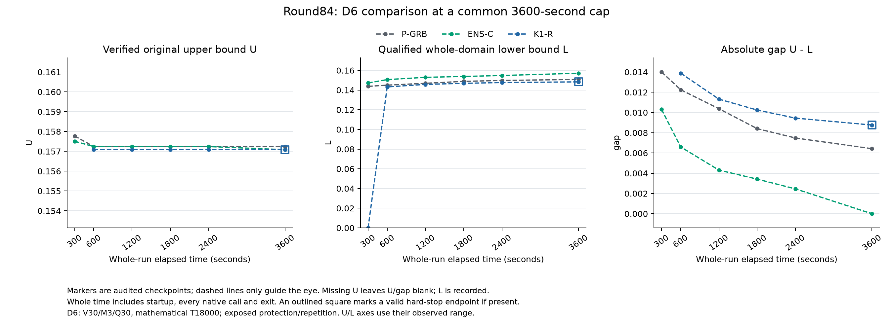
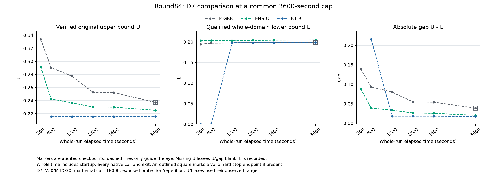
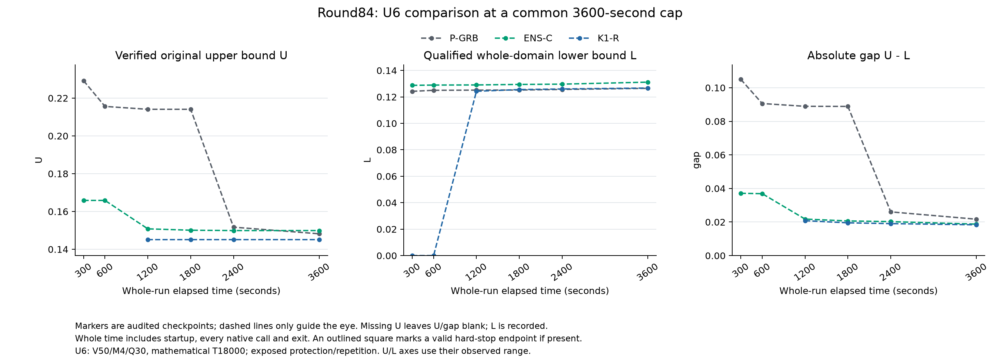

# Round84: D6 certification and finite U6 repetition

All nine original full runs are valid: seven normal returns and two valid
whole-run hard stops. Campaign, mechanism and replication audits pass. Ten
new evidence bundles verify twice, and all three figures pass visual review.
Evidence review is complete; draft publication is pending. Overall research
acceptance remains unmet. No production/default change or main merge.

The unchanged ENS-C candidate certifies D6 in3171.157s while current P-GRB and
K1-R remain open at the common3600s cap. On D7 its final absolute gap improves
47.2512% over P, but is19.1258% worse than K1. On U6 the13.5852% P gap gain
repeats, with worse U and stronger L. These are exposed development/protection
results; this stage supplies no new unadapted confirmation.

Base R83 final131d09280a1563243d0201e68367b26baf5079c3 / draft PR144.
Branch: codex/round84-ensc-long-protection-replication. Plan, original driver
and protocol were frozen before launch at3dae75c03. All arms use qualified
source4496078f25c0cdad1cf7a5c39835fd23121e8978 and executable
build/round83/v1/ExactEBRP.exe, SHA256
25b7ec3a6d89d9f0f921c2984fbb1d9876f36f67e617af144275c88b44e6255e.
Candidate preset: research-round83-vds-equal-net-exchange. K1-R uses
research-round65-k1-h. P-GRB remains the original compact model with native
defaults, no added Start/cuts/imported bounds. Gurobi13.0.2, Threads1, Seed0,
Presolve Auto, zero requested gaps and original numerical tolerances are common.
Runs are serial on processor2/mask4; no build or heavy audit overlaps them.

## Original endpoints and complete cost

All caps are3600s. D6 is V30/M3/Q30/T18000; D7 and U6 are V50/M4/Q30/T18000.
All use lambda.15 and pickup/drop60. Input paths and hashes are frozen in
protocol.json. U6 keeps its historical filename; it is now exposed data.
Paid time includes startup, all models/native calls, persistence and exit.

|Role|Arm|Paid seconds|Physical U|Global L|Signed absolute gap|Certificate|
|---|---|---:|---:|---:|---:|---|
|D6|P-GRB|3597.187|0.157241175852|0.150815481936|0.00642569391638|open|
|D6|ENS-C|3171.157|0.157083131103|0.157083131103|4.19109191796e-15|yes|
|D6|K1-R|3598.078|0.157083131103|0.148318036317|0.00876509478613|open; hard stop|
|D7|P-GRB|3598.047|0.237284991549|0.198586493177|0.0386984983716|open; hard stop|
|D7|ENS-C|3597.187|0.225150850056|0.204737856318|0.0204129937373|open|
|D7|K1-R|3597.250|0.215644075316|0.198508420283|0.0171356550333|open|
|U6|P-GRB|3597.110|0.148197475295|0.126519167936|0.0216783073591|open|
|U6|ENS-C|3597.140|0.149905475899|0.131172210905|0.0187332649936|open|
|U6|K1-R|3597.156|0.145069572386|0.126723807745|0.0183457646411|open|

Final relative gaps (U-L)/abs(U) are D6 P.0408652/K1.0557991;
D7 P.1630887/ENS.0906636/K1.0794627; U6 P.1462799/ENS.1249672/K1.1264618.
The full-precision signed values remain in campaign/endpoint_checks.json.
Tiny differences between committed objective payloads and independently
recomputed endpoints are retained in checkpoint and endpoint records. No gap
is clipped, and no bounds are spliced between runs.

D6 repairs a current proof deficit: K1 has a better physical U than P but a
weaker L and a materially larger gap. ENS obtains a numerical certificate
within the same whole cap. This is one current long realization; the important
certificate gain still warrants a finite repeat, not an immediate broad claim.

D7 ENS improves both bounds against P. Against K1, its U is worse by.00950677
while L is stronger by.00622944; gap increases.00327734, a material but not
severe final loss under the frozen rule. ENS retains84.8010% of K1's absolute-gap
advantage over P. At1200s the K1 loss is larger: gap.0332378491491 versus
.0179143527959, an85.5375% increase and.0153234963531 absolute loss, meeting
the severe checkpoint rule. At that same checkpoint ENS still improves P
gap58.4705% and retains75.3324% of K1's P advantage. The1800/2400s K1 losses
are material; the complete trajectory is retained. This tradeoff is neither
hidden by the final result nor an automatic veto based on K1 alone.

U6 ENS improves P gap13.5852%, despite U worse by.00170800, because L is
stronger by.00465304. Against current K1 it has worse U and stronger L, with
gap larger by.000387500353 (2.1122%): near under both frozen material thresholds.
It retains88.3722% of K1's current P gap advantage. The claim concerns the
complete method and its proof/primal tradeoff, not uniformly better UB search.

## Original observed trajectories

Each marker uses the original completed observation time. K1's first physical
witness is available at325.828s on D6,595.266s on D7 and872.218s on U6.
Thus K1 U/gap are unavailable at300s on all roles and at600s on U6. D7 K1
at600s has U.215644075316 and valid L0; its relative gap1.0 is computed from
those finite values, not substituted for a missing U. Dashed segments only
guide the eye. Outlined squares identify valid hard-stop endpoints.

|Seconds|D7 P gap|D7 ENS gap|D7 K1 gap|U6 P gap|U6 ENS gap|U6 K1 gap|
|---:|---:|---:|---:|---:|---:|---:|
|300|.139455120920|.088134630218|unavailable|.104995467453|.037112177972|unavailable|
|600|.093231319381|.038977268731|.215644075316|.090591066071|.036891117692|unavailable|
|1200|.080034387219|.033237849149|.017914352796|.088931779516|.021755816661|.020797458618|
|1800|.054511362931|.026444054924|.017914352796|.088870948237|.020643602741|.019521521312|
|2400|.053972977270|.025352886303|.017914352796|.026048598138|.020245892457|.019049559195|
|3600|.038698498372|.020412993737|.017135655033|.021678307359|.018733264994|.018345764641|

## Finite repetition and actual execution

The U6 P/ENS/K1 repeat matches source, binary, input, cap, flags and affinity
to R83. P and ENS reproduce their exact finalized U/L/gap values. K1 retains
the same U and improves L by2.81848077080e-6, below the frozen material rule.
Its HGA still runs2743 generations with2000 no-improve, but completes at
872.144s rather than the earlier925.445s. Both complete paid realizations and
all18 matched checkpoint rows are retained; no preferred repeat is selected.
This is descriptive finite repetition, not statistical equivalence. R83's U6
order was P/BDS/ENS/K1; R84 is P/ENS/K1. The relative order of repeated arms
is preserved, but the entire campaign order is not identical. BDS is not
repeated here, and old-build D6/D7 rows are historical context only.

Actual ENS startups complete all25 logical decoded paths and match their
R83 startup traces. D6 executes4 exchanges/0 relocations/0 insertions/4 quantity
moves; D7 executes3/3/2/38; U6 executes17/0/6/61. The respective equal-net-pair
counts are1161,7519,17687. All exhaust their declared neighborhoods and hand
off their final routes. Physical startup F and observation time are
D6 .157509803615/5.829s, D7 .291448973504/10.266s and U6 .173039905739/13.265s.
No archived route enters the algorithm.

|Role|P LP/MIP starts|ENS LP/MIP starts|K1 LP/MIP starts|
|---|---:|---:|---:|
|D6|0/1|5/1|5/2|
|D7|0/1|3/1|5/1|
|U6|0/1|5/1|7/2|

ENS's final MIP covers G in[0,.0787549018073] on D6,
[0,.291448973504] on D7 and[0,.0865199528693] on U6. Its initial cutoffs
remain.157509803615,.291448973504,.173039905739. Full domain coverage passes
independent audit. The D6 terminal MIP has30485 rows/8273 columns and spends
3160.92 native seconds; D7 has104726/25943 and3569.37s; U6 has104352/25569
and3549.43s. These rounded native figures explain costs and do not replace
whole-run time. Different startup, cutoff and downstream search effects are
not separately identified by this full-method comparison.

All three actual Starts are eligible, fully mapped, read back and accepted by
the native log. Maximum independent row violation is1.01141317543e-13 and
maximum readback difference0. Six P/K1 controls contain no added Start decisions.
Acceptance itself is not evidence of causal speed benefit.

## Evidence, cost and scope

There are41 Optimize starts/39 returns and31950.312 paid process seconds.
The two missing returns are the original D6 K1 and D7 P whole-run hard stops,
both inside the cap with valid committed U/L evidence and no certificate.
Neither is presented as normal, rerun or discarded. All other runs return
normally. There are no invalid native runs, extra seeds or extensions.

The audit validates274 measured source hashes,547 physical witnesses
(541 native plus6 startup),9519 global-bound events and10155 committed events.
All54 checkpoints,54 pair comparisons,18 protection records and3 cross-arm
consistency roles are retained. No uncommitted payload or unseen receipt is
promoted. Cross-arm checks are offline consistency checks, not combined results.

This stage has0 new builds,0 new qualification tests,0 separate startup runs
and0 generated inputs. R83's62 tests/165 qualification calls and measured-source
bytes are hash-bound, not rerun or charged again. Fresh preflight1.0566501s
includes three zero-Optimize compact exports totaling.797s. Per-run replay
costs2.3706799s; final campaign audit65.2913098s, mechanism audit4.7642451s and
replication audit.0620300s. All audit durations are measured, not estimated.

Ten new bundles contain20726 files,410953533 raw bytes and61518480 delivered
bytes. Packaging plus first verification costs31.4087026s; independent byte
verification2.2560620s. Both read every member without extraction or a solver.
Three inherited R83 source/qualification/startup bundles remain hash-bound.
Plotting costs1.6425359s using the existing Matplotlib3.11.2 environment;
first layout passes all three visual reviews. Executables, licenses and
credentials are excluded. See resource_summary.json and reproduce.md.

The unified algorithm and parameters remain exactly R83's. Equal-net block
exchanges preserve station operations and final inventory, enforce recipient
prefix capacity, and strictly descend the complete route-duration tuple before
reopening strict objective closure. The exact proof core still requires a
physical original U and valid complete-domain lower coverage. There is no new
time/Work slice, historical dispatch, tuning grid or exception. Numerical
certification is not a strict rational certificate; finite neighborhood descent
is not a speed theorem. See unified_method.md and the inherited mathematics.

No general novelty or adoption claim is added. D7's K1 loss and the earlier
BDS U6 failure remain visible. A finite D6 certificate repeat, remaining
E7/S12/D3/C2/C6/C8 protection and varied unadapted confirmation remain before
overall acceptance. Current resource snapshot: ordinary usage allowed,65%
weekly remaining, no reset consumed by this agent. Further work requires its
own finite stage plan after this draft is published.

One closure-metadata update initially read the existing research index using
Windows GBK and failed before writing that index. The failure and partial
metadata writes are recorded in metadata_encoding_failure.json; explicit UTF-8
completed the index. A subsequent context-mismatched documentation patch also
failed without a write, then was corrected against the actual line. Neither
required a native or audit rerun. The successful separate verify-only receipt
is saved in delivery_verify_only.json; an intermediate null metadata duration
was replaced from that original tool output, not from another verification.
